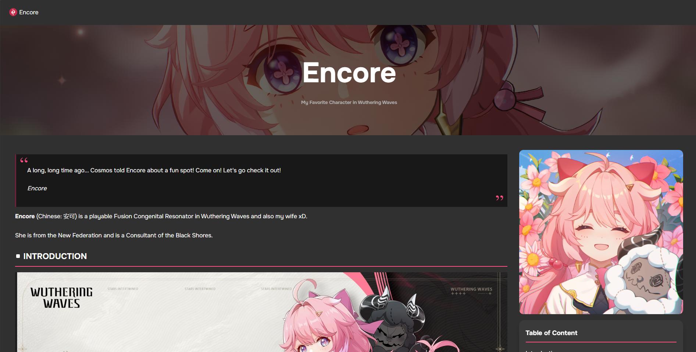
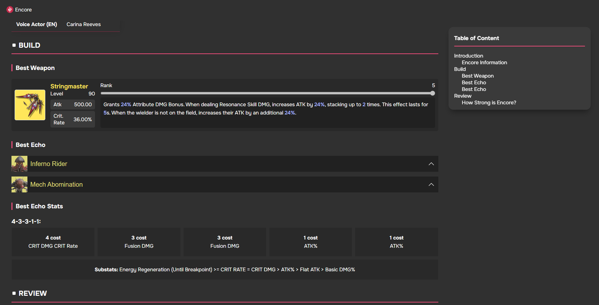
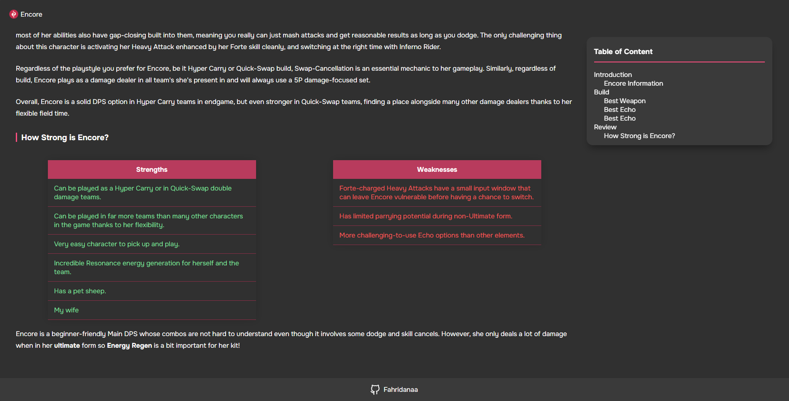

# Final Project - Belajar Dasar Pemrograman Web Dicoding: Character Encore Website for Wuthering Waves

This project, created as part of the Belajar Dasar Pemrograman Web course by Dicoding, showcases the fundamentals of web development. The website is built using HTML and CSS, with some JavaScript to enhance interactivity. It focuses on presenting character encores in Wuthering Waves with a clean and responsive design.

## Criteria

- [x] Terdapat elemen **Header, Footer, Main, Article,** dan **Aside**
- [ ] Masing-masing elemen wajib berisi konten yang peruntukkannya sesuai dengan elemen tersebut (menerapkan konsep semantic HTML dalam menyusun struktur website).
- [x] Wajib menampilkan menampilkan foto di elemen <aside>
- [x] Menyusun layout menggunakan **flexbox**, bukan **float**.

## Screenshots

## References

- https://game8.co/games/Wuthering-Waves/archives/454221
- https://wuthering.gg/characters/encore
- https://www.prydwen.gg/wuthering-waves/characters/encore
